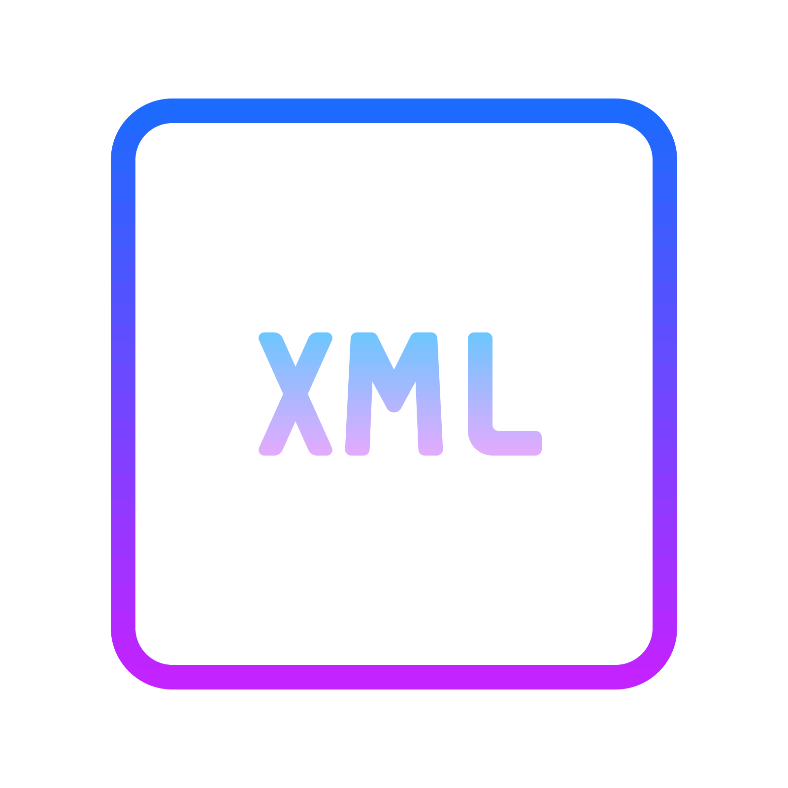

<h2>
 Quick-cli xml parser
</h2>
<h4> 
 A simple command line tool to parse xml files and save into a database of your choice (sqlite, mysql, postgres, mongodb). 
</h4>

## Documentation

You can follow these steps to get started with the project.

#### Clone the repository
    
    git clone git@github.com:cashewcodes9/quickCLI.git

#### Install the dependencies

        composer install

#### Create a `.env` file

        cp .env.example .env

#### Run migrations

        php artisan migrate

#### Run the command

 The first argument of the command is path to the xml file. There is an option to select the database you want to save your xml data in. The default database is <b>sqlite</b> 

        php quick-cli parse:xml <path-to-xml-file> --db=<database-name>

 If you are using <b>sqlite</b> database, you can run

        php quick-cli parse:xml <path-to-xml-file>

#### Run the tests

A php testing framework <b>Pest</b> is being used to test the application. To run the tests, run the following command: 

        ./vendor/bin/phpunit

## Help

 You can list all the available commands with: 

    
            php quick-cli list

## Testing

## License

Laravel Zero is an open-source software licensed under the MIT license.
